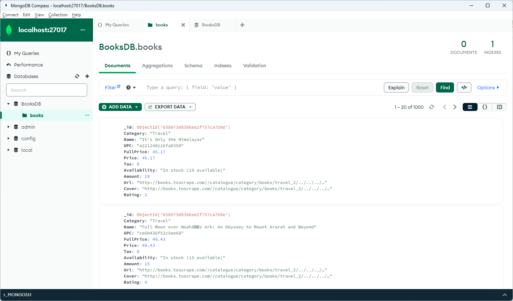

# Сбор и разметка данных (семинары)
## Урок 3. Системы управления базами данных MongoDB и Кликхаус в Python

### Задание

1. Установите MongoDB на локальной машине, а также зарегистрируйтесь в онлайн-сервисе. https://www.mongodb.com/ https://www.mongodb.com/products/compass
2. Загрузите данные который вы получили на предыдущем уроке путем скрейпинга сайта с помощью Buautiful Soup в MongoDB и создайте базу данных и коллекции для их хранения.
3. Поэкспериментируйте с различными методами запросов.
4. Зарегистрируйтесь в ClickHouse.
5. Загрузите данные в ClickHouse и создайте таблицу для их хранения.

### Решение

Решение предоставлено в файле *main.py*

К сожалению сервис ClickHouse был недоступен. Задание выполнено без пунктов 4-5. 

#### Результат работы:

Работа программы:

    C:\Work\python\Data\PyData_dz3\venv\Scripts\python.exe C:\Work\python\Data\PyData_dz3\main.py 
    Data uploaded into MongoDB! 1000 documents in collection.
    ==========================
    Found one book, named "Under the Tuscan Sun":
    {
        "_id": {
            "$oid": "658973d0386ee2f757ca7ba1"
        },
        "Category": "Travel",
        "Name": "Under the Tuscan Sun",
        "UPC": "a94350ee74deaa07",
        "FullPrice": 37.33,
        "Price": 37.33,
        "Tax": 0.0,
        "Availability": "In stock (7 available)",
        "Amount": 7,
        "Url": "http://books.toscrape.com//catalogue/category/books/travel_2/../../../under-the-tuscan-sun_504/index.html",
        "Cover": "http://books.toscrape.com//catalogue/category/books/travel_2/../../../under-the-tuscan-sun_504/../../media/cache/45/21/4521c581ba727f5c835e34860cbf53e5.jpg",
        "Rating": 3
    }
    ==========================
    Found books whose titles begin with "Uns%":
    [
        {
            "Name": "Unseen City: The Majesty of Pigeons, the Discreet Charm of Snails & Other Wonders of the Urban Wilderness",
            "FullPrice": 44.18
        },
        {
            "Name": "Unstuffed: Decluttering Your Home, Mind, and Soul",
            "FullPrice": 58.09
        }
    ]
    ==========================
    Counting books by category and printing those categories with more than 70 books:
    [
        {
            "_id": "Nonfiction",
            "Category_length": 110
        },
        {
           "_id": "Default",
           "Category_length": 152
        },
        {
            "_id": "Sequential Art",
            "Category_length": 75
        }
    ]
    
    Process finished with exit code 0
 
Данные в MongoDB Compass:

Файл с данными скрейпинга: [source.json](source.json)
